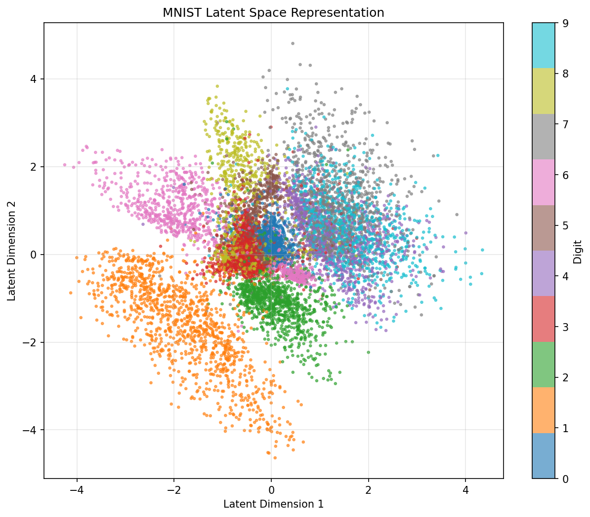
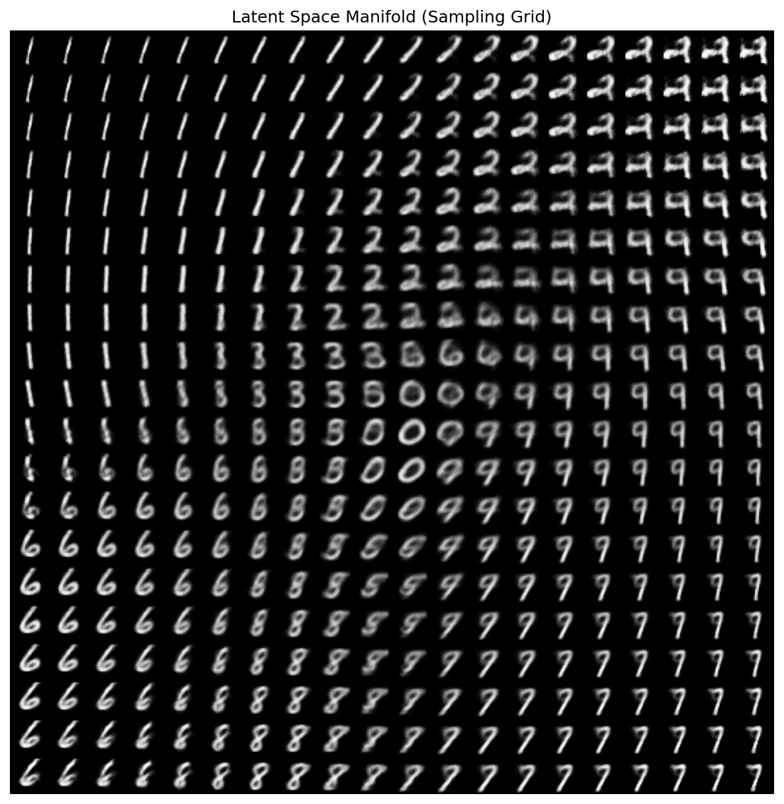
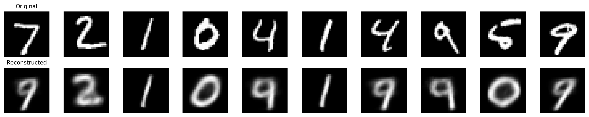
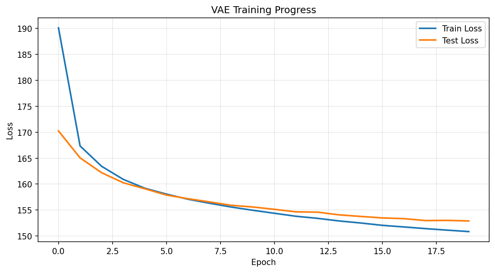

# Variational Autoencoder (VAE) for MNIST

A complete PyTorch implementation of a Variational Autoencoder with latent space exploration capabilities.

## 📊 Results

### Latent Space Visualization
The model clusters similar digits together in 2D space:



### Generated Manifold
Smooth transitions between digit types:



### Reconstruction Quality
Original (top) vs Reconstructed (bottom):



### Training Progress


## 🎯 What is a VAE?

A Variational Autoencoder is a generative model that:
- **Encodes** input data into a latent probability distribution
- **Samples** from this distribution using the reparameterization trick
- **Decodes** samples back to reconstructions
- Learns a structured, continuous latent space for generation

## 📋 Requirements

```bash
pip install torch torchvision matplotlib numpy tqdm --break-system-packages
```

## 🚀 Quick Start

Simply run:
```bash
python vae_mnist.py
```

This will:
1. Download MNIST dataset (if needed)
2. Train the VAE for 20 epochs
3. Generate visualization plots
4. Save the trained model

## 📊 Generated Outputs

### 1. **training_curves.png**
Shows how the loss decreases during training.

### 2. **reconstructions.png**
Compares original MNIST digits with their reconstructions. Shows how well the model learned to encode and decode.

### 3. **latent_space.png** ⭐
The most interesting visualization! Shows all test images projected into 2D latent space, colored by digit class.
- Similar digits cluster together
- You can see the topology of digit space
- Smooth transitions between digit types

### 4. **manifold.png** ⭐
A grid of generated images created by sampling different points in the latent space.
- Shows smooth interpolation between different digit types
- Demonstrates the continuous nature of the learned space
- Each point in the grid corresponds to a different latent coordinate

## 🧠 Understanding the Architecture

```
Input (784) → Encoder → [μ, log(σ²)] → Reparameterization → z (2D) → Decoder → Output (784)
```

**Key Components:**
- **Encoder**: Maps 784-dim images to 2D latent distribution parameters (mean & variance)
- **Reparameterization Trick**: Samples z = μ + σ * ε (where ε ~ N(0,1))
- **Decoder**: Reconstructs 784-dim images from 2D latent vectors
- **Loss Function**: Reconstruction loss (BCE) + KL divergence

## 🔍 Latent Space Exploration

The 2D latent space makes it easy to:

1. **See digit clusters**: Similar digits group together
2. **Generate new digits**: Sample any point (x, y) in latent space
3. **Interpolate**: Smoothly transition between digits
4. **Understand structure**: See how the model organizes information

## 📈 Key Hyperparameters

| Parameter | Value | Description |
|-----------|-------|-------------|
| latent_dim | 2 | Dimension of latent space (2D for visualization) |
| hidden_dim | 400 | Size of hidden layers |
| batch_size | 128 | Training batch size |
| learning_rate | 1e-3 | Adam optimizer learning rate |
| epochs | 20 | Number of training epochs |

## 🎓 Educational Notes

### Why KL Divergence?
The KL term regularizes the latent space to follow a standard normal distribution N(0,1). This:
- Prevents "holes" in the latent space
- Ensures smooth interpolation
- Allows generation by sampling from N(0,1)

### Why 2D Latent Space?
While 2D is limited for complex data, it's perfect for:
- Visualization and understanding
- Learning VAE concepts
- Seeing the structure emerge

For production, you'd typically use 10-100 dimensions.

### The Reparameterization Trick
Direct sampling from N(μ, σ²) isn't differentiable. Instead:
```
z = μ + σ * ε, where ε ~ N(0,1)
```
This makes the randomness independent of the parameters we're learning.

## 🔧 Customization

### Change Latent Dimensions
```python
# In main(), modify:
'latent_dim': 10,  # Higher dimensions for better reconstruction
```

Note: Latent space visualization only works with 2D.

### Train Longer
```python
'epochs': 50,  # More epochs for better convergence
```

### Adjust Learning Rate
```python
'learning_rate': 5e-4,  # Lower for more stable training
```

## 📁 File Structure

```
vae_mnist.py          # Main implementation
README.md             # This file
vae_model.pth         # Saved model (after training)
training_curves.png   # Loss plots
reconstructions.png   # Original vs reconstructed
latent_space.png      # 2D latent space visualization
manifold.png          # Generated digit grid
data/                 # MNIST dataset (auto-downloaded)
```

## 🎨 Experiment Ideas

1. **Explore the manifold**: Find regions that generate different digits
2. **Interpolate**: Draw a path between two digits in latent space
3. **Increase dimensions**: Try latent_dim=10 for better reconstructions
4. **Modify architecture**: Add more layers or change activation functions
5. **Try different datasets**: Fashion-MNIST, CIFAR-10 (needs CNN encoder/decoder)

## 📚 Further Reading

- Original VAE paper: [Auto-Encoding Variational Bayes](https://arxiv.org/abs/1312.6114)
- Tutorial: [Understanding VAEs](https://towardsdatascience.com/understanding-variational-autoencoders-vaes-f70510919f73)
- Advanced: β-VAE, VQ-VAE, VAE-GAN hybrids

## 💡 Tips

- **GPU acceleration**: Automatically uses CUDA if available
- **Memory**: Reduce batch_size if you run out of memory
- **Convergence**: Loss should steadily decrease. If it plateaus early, try lower learning rate
- **Latent space**: If clusters overlap heavily, try increasing latent_dim

Enjoy exploring the latent space! 🚀
